# Ecowave
Application Web développée en collaboration avec [Mattéo Ladrat](https://github.com/Apokalypt), [Jean Laurent](https://github.com/jeanlrnt), [Emma Nguyen Van Giau](https://github.com/Emma-NVG) et [Benjamin Pelaudeix](https://github.com/Benjamin-Pelaudeix) lors de la Nuit de l'info 2020. 

## Présentation 
La Nuit de l'Info est une compétition nationale qui réunit tous les acteurs du domaine informatique. Elle s'est déroulée le jeudi 3 décembre de 16H39 au vendredi 4 décembre à 8H02, pour un total de 15H32 d'épreuve. Lors de cette compétition nous devons répondre au sujet national donné. En plus, nous avons la possibilité de répondre à d'autres défis proposés. Cet édition était le premier gros défi auquel nous participions.
Le sujet national part d'un réel besoin autour du surf et de l'environnement. En effet, chaque sportif a besoin de consulter des données avant de partir sur l'eau comme la marée, la houle, la température, le temps... toutes ces données importantes pour lui assurer une bonne session. Cependant depuis quelques années, le sujet nous informe qu'il y a un enjeu médical dérrière chaque session, en effet la pollution environnementale met parfois en danger la vie des pratiquants.

Notre défi : créer une application Web permettant de répertorier toutes ces données dans une même application. Elle aura pour but d'informer les sportifs mais aussi de leur faire partager leur expérience afin d'informer d'autres sportifs. 

D'autres défis étaient disponbiles, nous avons choisis les défis suivants : 
* Création d'un logo à l'image du projet
* Traduction de l'application en anglais
* Communiquer sur l'application
* Traduction de l'application en leet speak

## Détails du projet
Nous avons décidé d'élaborer ce site avec l'objectif de le rendre fonctionnel et non pas uniquement esthétique même si nous savions que ce serait difficile de terminer le projet comme nous le souhaitions dans le temps imparti. 
Malheureusement, il y a eu un écart entre la version rendue et celle que nous espérions car nous n'avons pas eu le temps de terminer ce projet, il manque notamment des éléments dans l'enregistrement d'une session, le module de déconnexion et la gestion de statistiques...
Pour présenter aussi ce qu'aurait dû être la version définitive, des maquettes seront présentées tout au long de la description.

On peut découper le projet en 3 parties : 
* Page d'accueil
* Enregistrement d'une session
* Profil

### Page d'accueil 
Le nom de l'application est "ECOWAVE". Pourquoi ce nom ? Car les deux mots clés du sujet s'y trouve, "ECO" pour l'écologie et l'aspect environnemental autour de l'eau et "WAVE" pour rappeler la vague et par conséquent les sports nautiques comme le surf.
L'équipe a pensé au hashtag #BALANCETONSPOT, dérivé d'un hashtag déjà existant et très connu. Le spot est l'endroit où l'on va surfer. 
Ces deux éléments ainsi que le bouton de redirection vers la connexion est intégré à la première partie de la page d'accueil.
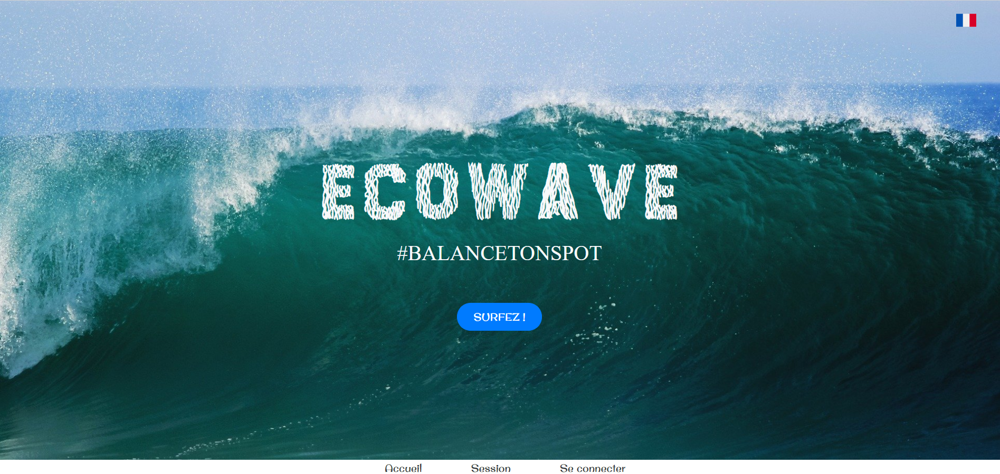

Dans la deuxième partie, on y trouve la présentation de l'association Surfrider, parraine de cette édition ainsi que la présentation de notre application "ECOWAVE".
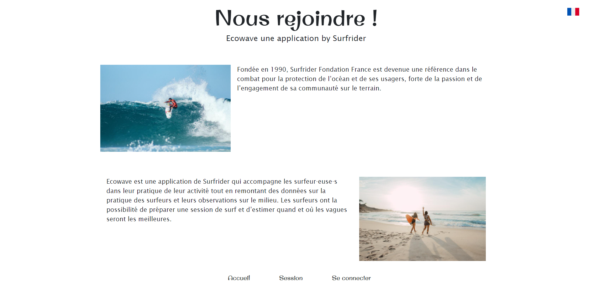

Un menu est disponible pour faciliter la navigation de l'utilisateur. Dans celui-ci on y retrouve 3 modules : 
* Accueil
* Session 
* Se connecter ou Profil

Si l'utilisateur est connecté, c'est un lien vers son profil qui est affiché. 

### Enregistrement d'une session
C'est le coeur de l'application : permettre au sportif d'être renseigné sur sa prochaine session mais aussi de renseigner d'autres sportifs en transmettant des informations via un formulaire rempli à la fin de la session. 
L'enregistrement d'une session est uniquement disponible aux personnes ayant un compte.  
Deux versions sont proposées : celle rendue et celle définitive(via des maquettes).

#### Version rendue 
Lorsque l'utilisateur est connecté, il peut cliquer sur "Surfez !" sur la page d'accueil ou "Session" du menu pour accéder à cette page :

Cette interface permet à celui-ci de rechercher son spot, via une liste qui peut être filtrée par pays ou bien par région. 

#### Version définitive
Lorsque l'utilisateur a trouvé son spot il peut consulter des informations sur la météo.
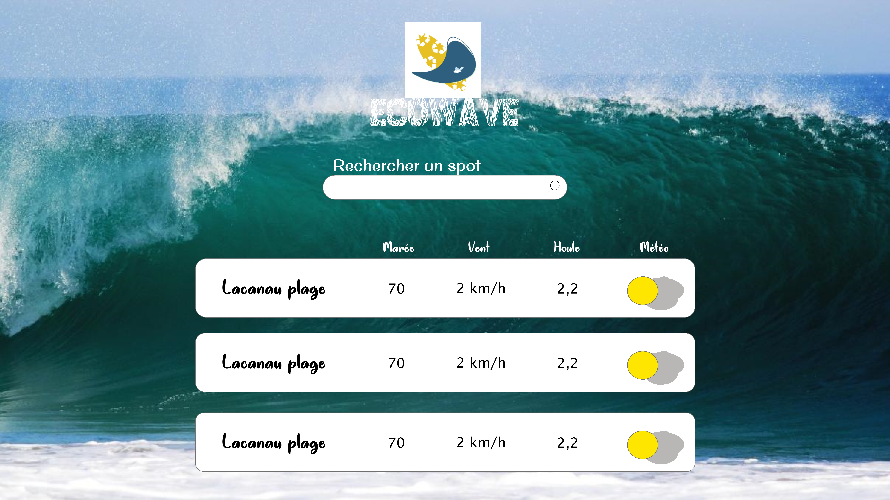
En cliquant sur le spot il découvrira d'autres statistiques, celles environnementales. En effet, la qualité de l'eau est très importante, une eau polluée est la cause de nombreux cas de maladies chez les surfeurs. De plus si certains sportifs ont laissés des avis sur ce spot, ils seront consultables à cet endroit-ci.
Il peut aussi bien sûr démarrer une session grâce au bouton "play". 
Version ordinateur : 
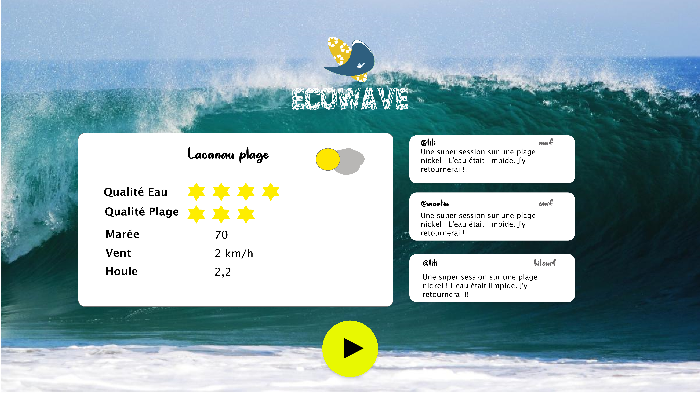
Version Mobile : 
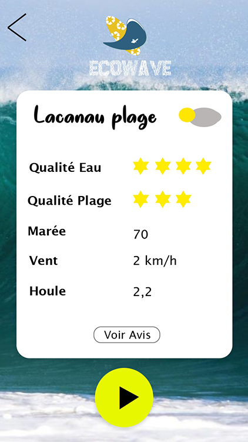
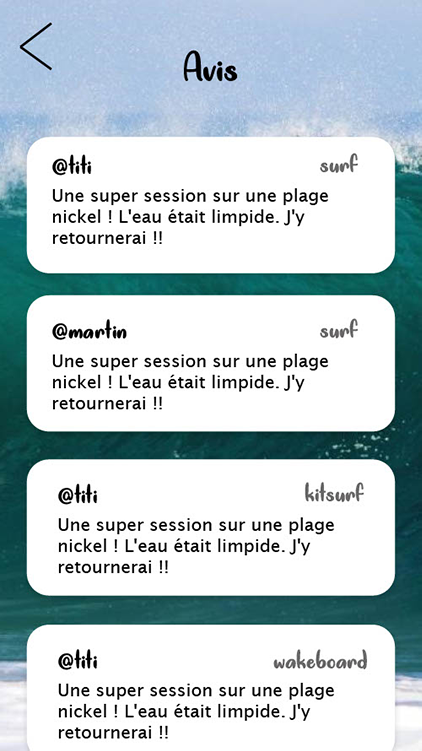

Une fois sa session terminée il peut cliquer sur le bouton stop : 
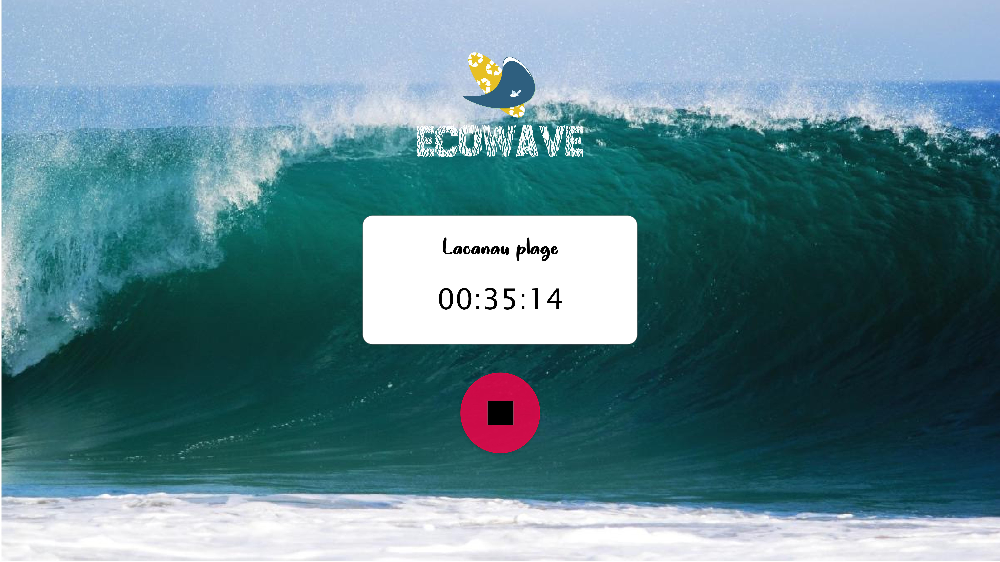

L'utilisateur accède ensuite au formulaire de fin de session, que nous avons essayé de rendre "ludique" car il faut que ce formulaire soit rapide pour ne pas déranger le surfeur. 
Certaines questions sont orientées de façon à répondre par des images pour que cela soit intuitif, rapide et exploitable pour nous. 
Malgré tout il possède un champ pour s'exprimer librement. Ce champ sert d'avis et sera publié sur la page "détails" du spot.
Version ordinateur : 
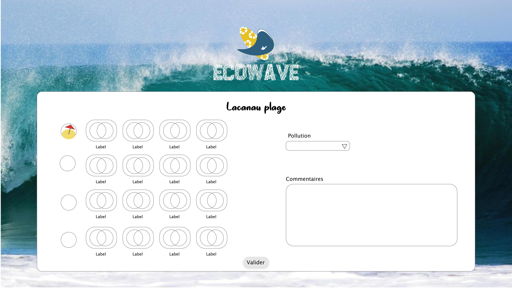

Version mobile :
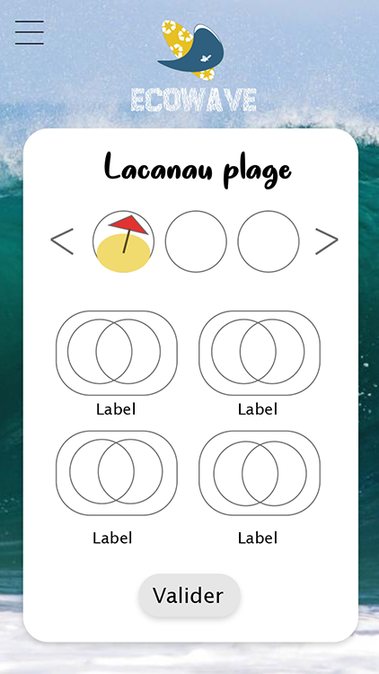

Une fois ce questionnaire envoyé, l'utilisateur est redirigé vers l'accueil. 

### Profil
Ici l'utilisateur peut consulter ses informations : 
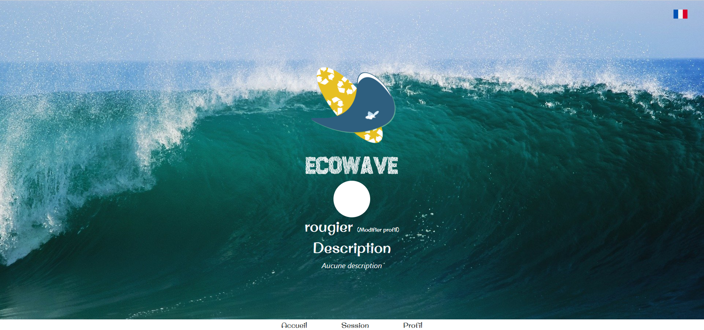
Le profil permet aussi à l'utilisateur de modifier ses données comme le mot de passe, son adresse mail ou son pseudo ou d'ajouter une photo de profil. 
Nous aurions aimé intégrer une liste de ses sessions si nous avions eu plus de temps.
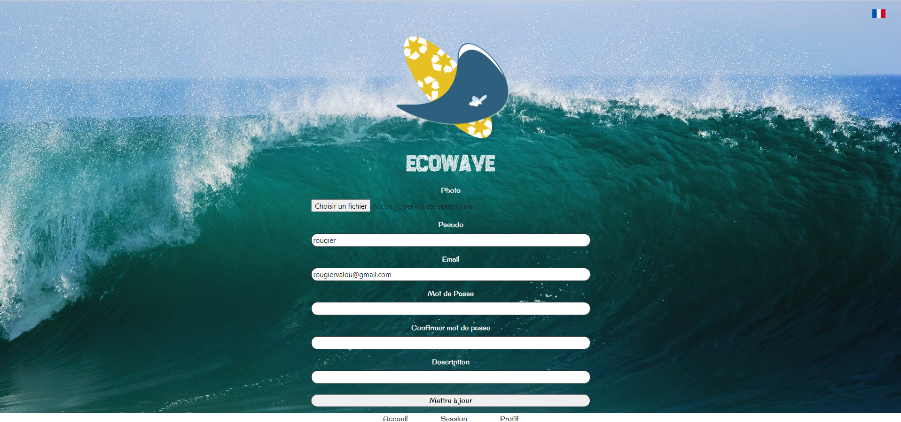

### Défis 

#### Logo
Il fallait intégrer dans le logo, tous les éléments incontournables présents dans le sujet. 
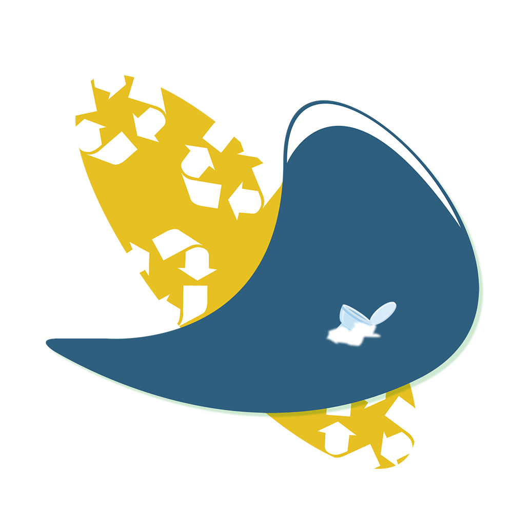

#### Site bilingue : français/anglais
La langue de l'application est modifiable en cliquant sur le drapeau en haut à droite.
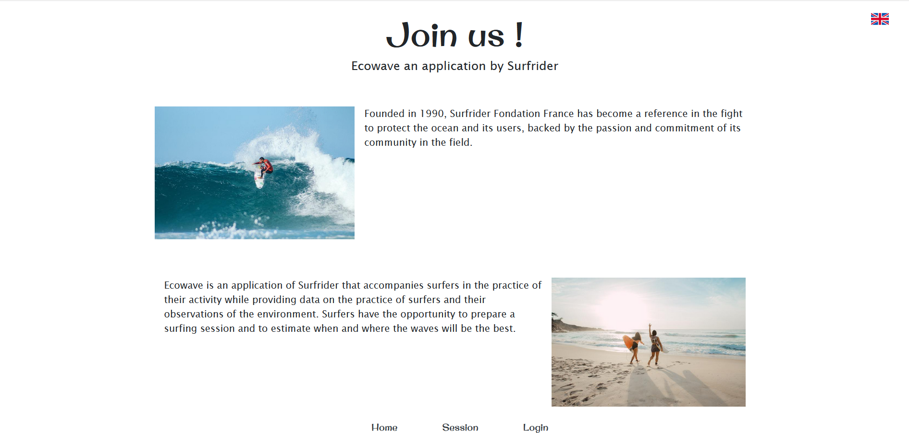

#### Site en leet speak 
Tout comme la langue, la traduction en leet speak se situe en haut à droite de l'écran.
Le leet speak c'est quoi ? C'est un langage qui remplace chaque caractère par des caractères ressemblant. Par exemple "5" devient "S". 
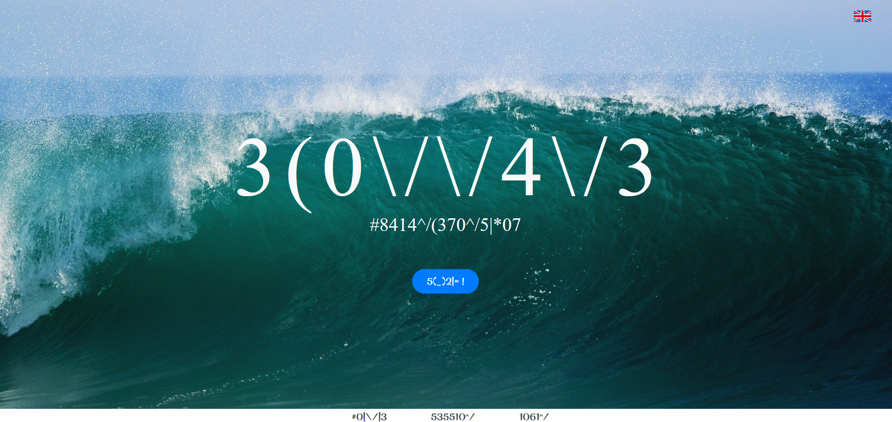

## Spécifications techniques
Du fait de nos connaissances, nous avons souhaité utiliser les langages PHP et Javascript en plus des traditionnels HTML et CSS. 
Pour récupérer les données météorologiques précises de chaque spot, nous avons utilisé l'API proposée par World Weather Online car celle-ci propose toutes les informations dont nous avions besoin.
